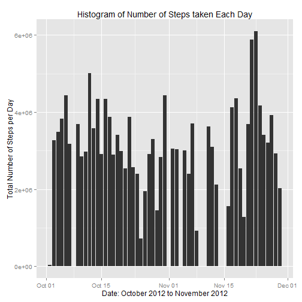
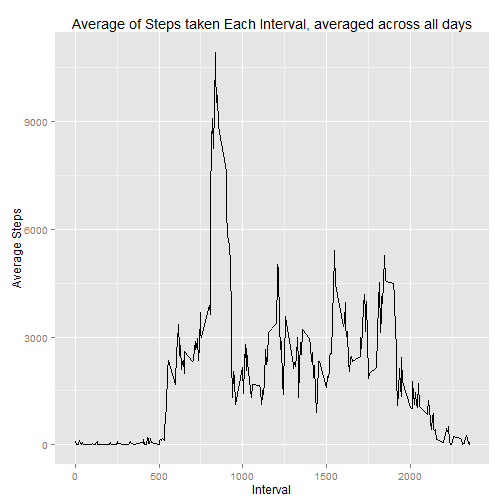
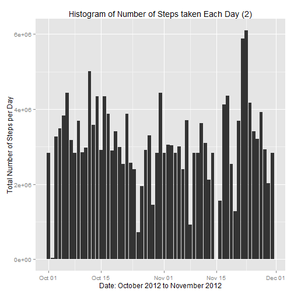
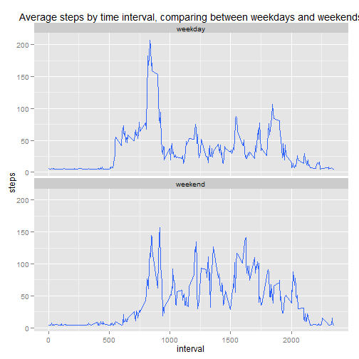

Reproducible Research: Peer Assignment 1
====================================================

## Introduction:

As stated in the introduction to this assignment, the assignment makes use of data from a personal activity monitoring device. This device collects data at 5 minute intervals through out the day. The data consists of two months of data from an anonymous individual collected during the months of October and November, 2012 and include the number of steps taken in 5 minute intervals each day*.


##Loading and preprocessing the data
----------------------------------

The data-set for the assignment was supplied as a zipped file called *Activtiy monitoring data.zip* and the data stored in a variable named "activity".    

Read in the file, then convert the date field into date format & then exploring the data set.


```r
data <- read.csv("activity.csv", stringsAsFactors = FALSE)
data$date <- as.Date(data$date, format = "%Y-%m-%d")
head(data)
```

```
##   steps       date interval
## 1    NA 2012-10-01        0
## 2    NA 2012-10-01        5
## 3    NA 2012-10-01       10
## 4    NA 2012-10-01       15
## 5    NA 2012-10-01       20
## 6    NA 2012-10-01       25
```

```r
names(data)
```

```
## [1] "steps"    "date"     "interval"
```

```r
summary(data)
```

```
##      steps             date               interval     
##  Min.   :  0.00   Min.   :2012-10-01   Min.   :   0.0  
##  1st Qu.:  0.00   1st Qu.:2012-10-16   1st Qu.: 588.8  
##  Median :  0.00   Median :2012-10-31   Median :1177.5  
##  Mean   : 37.38   Mean   :2012-10-31   Mean   :1177.5  
##  3rd Qu.: 12.00   3rd Qu.:2012-11-15   3rd Qu.:1766.2  
##  Max.   :806.00   Max.   :2012-11-30   Max.   :2355.0  
##  NA's   :2304
```

```r
str(data)
```

```
## 'data.frame':	17568 obs. of  3 variables:
##  $ steps   : int  NA NA NA NA NA NA NA NA NA NA ...
##  $ date    : Date, format: "2012-10-01" "2012-10-01" ...
##  $ interval: int  0 5 10 15 20 25 30 35 40 45 ...
```

##What is mean total number of steps taken per day?
-------------------------------------------------

###1.Histogram of the total number of steps taken each day


```r
#total number of steps each day
dailySteps <-
  aggregate(formula = steps~date, data = data,
            FUN = sum, na.rm=TRUE)

library(ggplot2)
qplot(x=dailySteps$date, y=dailySteps$steps,
      data=subset(data, complete.cases(data)),
      stat='summary', fun.y=sum, geom='bar') +
  labs(title='Histogram of Number of Steps taken Each Day',
       y='Total Number of Steps per Day', x='Date: October 2012 to November 2012')
```

 

###2. Mean and Median total number of steps taken per day


```r
#mean
mean_dailySteps <- mean(dailySteps$steps)
mean_dailySteps
```

```
## [1] 10766.19
```

```r
#median
median_dailySteps <- median(dailySteps$steps)
median_dailySteps
```

```
## [1] 10765
```

## What is the average daily activity pattern?
-------------------------------------------

### 1.Time series plot (type = "l") of the 5-minute interval (x-axis) and the average number of steps taken, averaged across all days (y-axis)


```r
intervalSteps <- aggregate(steps ~ interval, data = data, FUN = mean, na.rm=TRUE)

qplot(x=intervalSteps$interval, y=intervalSteps$steps,
      data=subset(data, complete.cases(data)),stat='summary', fun.y=sum, geom='line') +
  labs(title='Average of Steps taken Each Interval, averaged across all days',
       y='Average Steps', x='Interval')
```

 

### 2. Which 5-minute interval, on average across all the days in the dataset, contains the maximum number of steps?


```r
#interval = 835
maxSteps <- intervalSteps[which
                          (intervalSteps$steps== max(intervalSteps$steps)),]

maxSteps
```

```
##     interval    steps
## 104      835 206.1698
```

## Imputing missing values
------------------------------------------------------------------------

### 1. Total number of missing values in the dataset 


```r
sum(!complete.cases(data))
```

```
## [1] 2304
```

### 2. Filling in missing data by median intervalSteps


```r
activityData2 <- data
activityData2$steps[is.na(activityData2$steps)] <- median(intervalSteps$steps)
```

### 3. confirm that New data set created with missing values are filled in


```r
# Confirm that there is no longer any missing data
sum(is.na(activityData2$steps))
```

```
## [1] 0
```

```r
summary(activityData2)
```

```
##      steps             date               interval     
##  Min.   :  0.00   Min.   :2012-10-01   Min.   :   0.0  
##  1st Qu.:  0.00   1st Qu.:2012-10-16   1st Qu.: 588.8  
##  Median :  0.00   Median :2012-10-31   Median :1177.5  
##  Mean   : 36.95   Mean   :2012-10-31   Mean   :1177.5  
##  3rd Qu.: 34.11   3rd Qu.:2012-11-15   3rd Qu.:1766.2  
##  Max.   :806.00   Max.   :2012-11-30   Max.   :2355.0
```

### 4. Histogram of the total number of steps taken each day. 


```r
dailySteps2 <-
  aggregate(formula = steps~date, data = activityData2,
            FUN = sum, na.rm=TRUE)

library(ggplot2)
qplot(x=dailySteps2$date, y=dailySteps2$steps,
      data=subset(activityData2, complete.cases(activityData2)),
      stat='summary', fun.y=sum, geom='bar') +
  labs(title='Histogram of Number of Steps taken Each Day (2)',
       y='Total Number of Steps per Day', x='Date: October 2012 to November 2012')
```

 

#### Calculate and report the mean and meadian of total number of steps taken each day


```r
#mean
mean_dailySteps2 <- mean(dailySteps2$steps)
mean_dailySteps2
```

```
## [1] 10642.7
```

```r
#median
median_dailySteps2 <- median(dailySteps2$steps)
median_dailySteps2
```

```
## [1] 10395
```

The mean of steps taken per day after imputing the missing values is  ``1.0642702 &times; 10<sup>4</sup>`` as against earlier mean containing the missing values ``1.0766189 &times; 10<sup>4</sup>``.  

The median of steps taken per day after imputing the missing values is  ``1.0395 &times; 10<sup>4</sup>`` as against earlier median containing the missing values ``10765``. 

Imputting the missing data values decreases the mean number of steps per day by ``-0.0114698``%.  

Imputting the missing data values decreases the median number of steps per day by ``-0.0343706``%.  

In conclusion,yes, the first part has a higher mean and median then the second part where I imputed the missing values i.e. imputin g the missing values with the median values **LOWERS** both the mean and median.

## Are there differences in activity patterns between weekdays and weekends?
----------------------------------------------


```r
#weekend or weekday using weekdays()function
day <- function(date){
    if (weekdays(as.Date(date)) %in% c("Saturday", "Sunday")) {
        "weekend"
    } else {
        "weekday"
    }
}

#creating day column
activityData2$day <- as.factor(sapply(activityData2$date, day))


#time series plot of the 5-minute interval (x-axis) and the average number of steps taken, averaged across all weekday days or weekend days (y-axis)

library(ggplot2)
qplot(x = interval, y = steps, data = activityData2, geom = "smooth", stat = "summary", fun.y = mean) + facet_grid(day ~ .) + facet_wrap(~ day, nrow = 2) + labs(title = "Average steps by time interval, comparing between weekdays and weekends")
```

 

